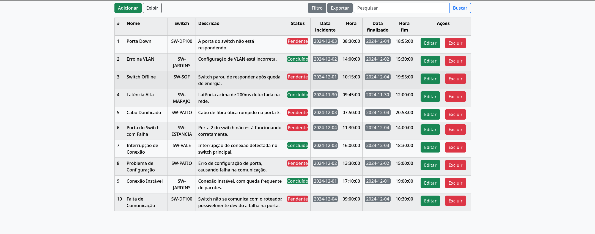
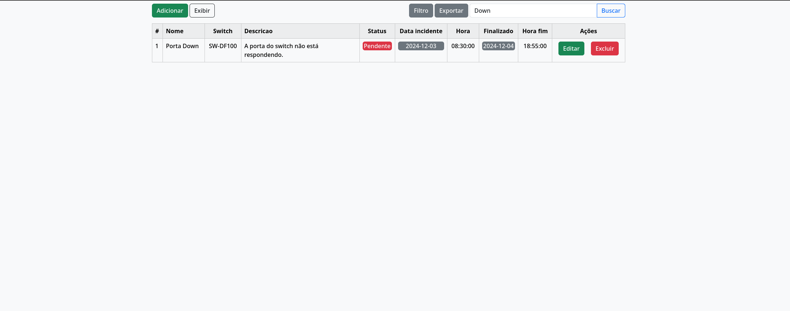
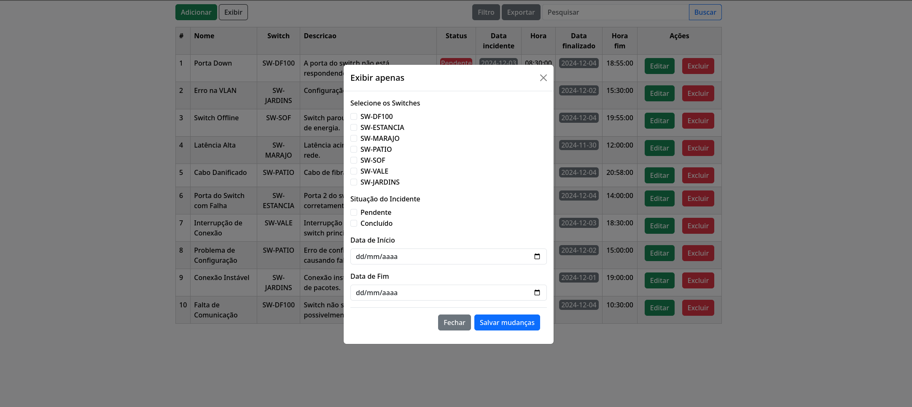
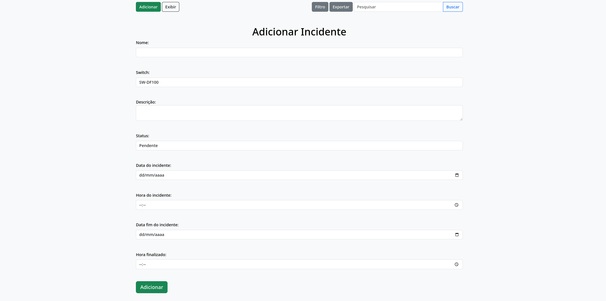
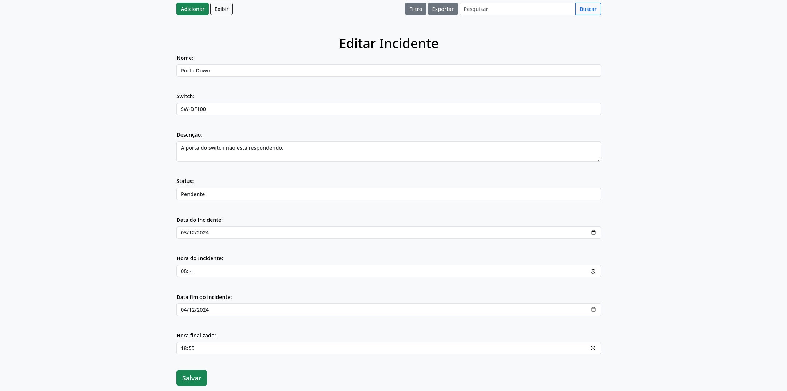

# Projeto CRUD em PHP com MySQL, Apache e Bootstrap

Este é um projeto de **CRUD** desenvolvido em **PHP**, com integração ao **MySQL** e utilizando **Bootstrap** para estilização. A aplicação está sendo executada em um ambiente configurado com **Apache**. Ela oferece funcionalidades básicas de gerenciamento de registros, além de recursos adicionais para busca e exportação de dados.

É importante ressaltar que o paradigma utilizado para o desenvolvimento dessa aplicação é o de **programação estruturada**.

---

## ⚙️ Funcionalidades

### 1. **CRUD Completo**:
- 📝 Criar, visualizar, editar e excluir registros de uma tabela no banco de dados.

### 2. **Busca Avançada**:
- 🔍 Implementação da pesquisa com a sintaxe **LIKE** do MySQL, permitindo localizar registros através de palavras-chave em colunas específicas.

### 3. **Exportação de Dados**:
- 📤 Utilização da função **fputcsv** do PHP para gerar um arquivo CSV contendo os dados da tabela, facilitando a exportação e compartilhamento das informações.

### 4. **Menu de Filtro**:
- 🛠️ Implementação de um menu de filtro para permitir que os usuários filtrem os registros por diferentes critérios, como **status**, **data**, **nome**, ou qualquer outro campo específico da tabela.
- Exemplo de filtros:
  - **Status**: Filtrar entre "Pendente" e "Concluído".
  - **Data**: Filtrar por intervalo de datas específicas.
  - **Nome**: Filtrar registros com base em um nome específico ou palavras-chave.

---

## 🖼️ Prévias

### 💡 Página Inicial


### 🔍 Busca de Registros


### 🛠️ Menu de Filtro


### 📋 Adicionar/Editar Registro




---

## 🛠️ Tecnologias Utilizadas

- **Linguagem Backend**: PHP
- **Banco de Dados**: MySQL
- **Servidor Web**: Apache
- **Frontend**: Bootstrap

---

## 🔧 Possíveis Melhorias

- Adicionar paginação à listagem de registros para lidar com tabelas muito grandes.
- Implementar autenticação de usuários para restringir o acesso ao CRUD.
- Tratamento para campos vazios no momento de inserção e edição.
- Inputs de data fim e hora fim aceitar para que aceite valores nulos

---
## 🚀 Como Configurar

1. Certifique-se de que seu ambiente tenha **PHP**, **MySQL** e **Apache** instalados e configurados.
2. Clone este repositório:
    ```bash
    https://github.com/DouradoCtrl/Crud_Incidents.git
    ```
